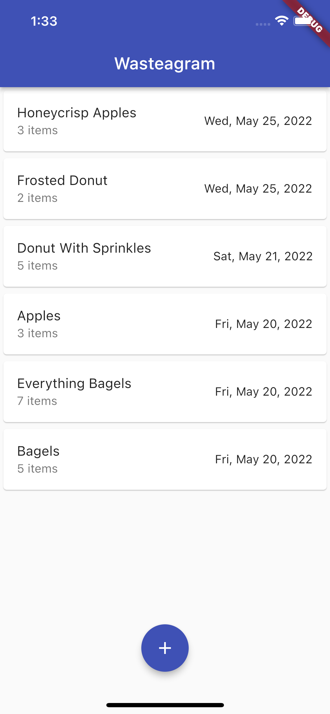
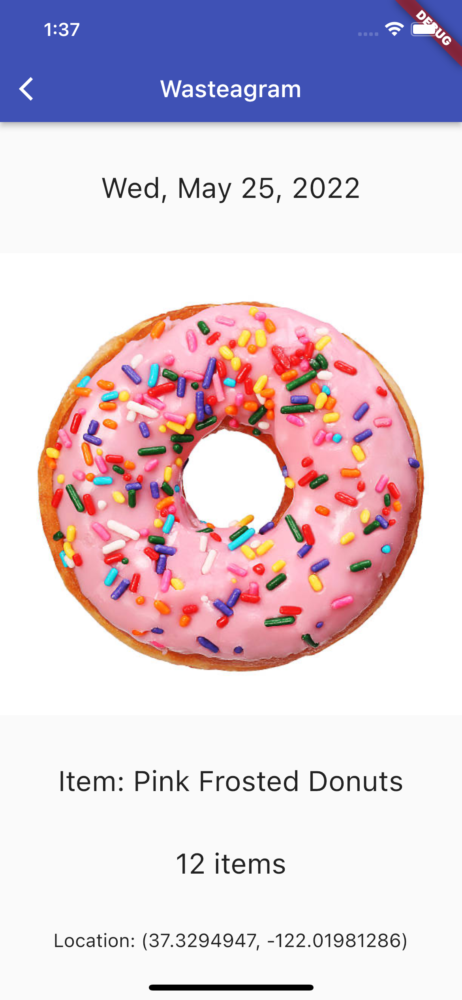
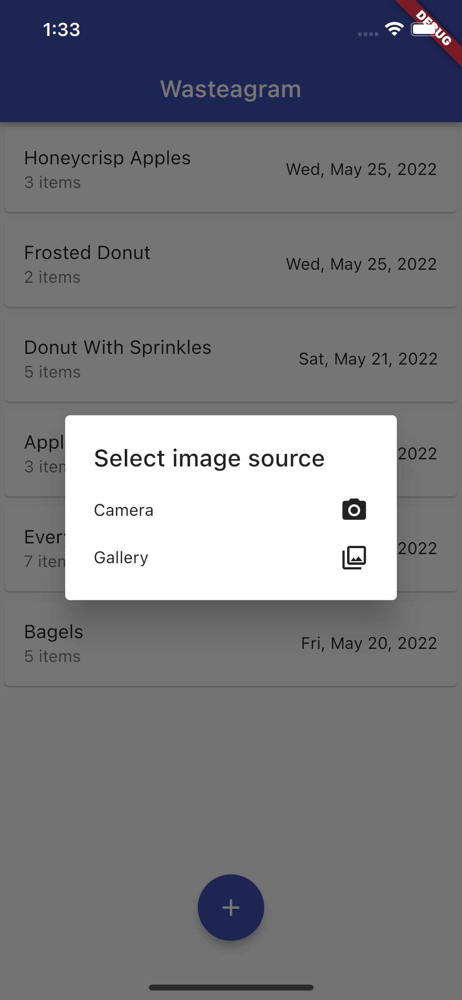
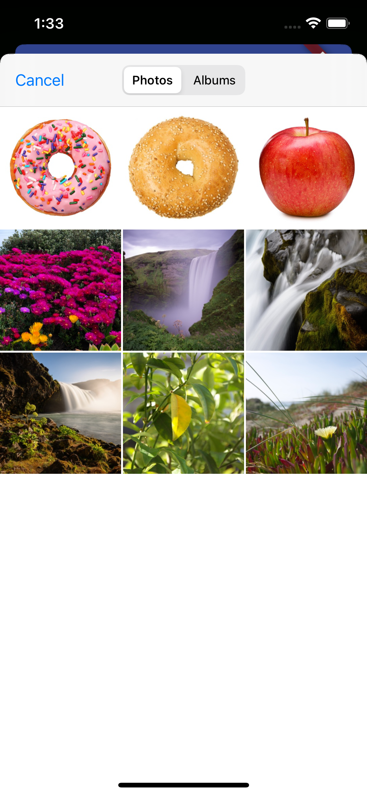
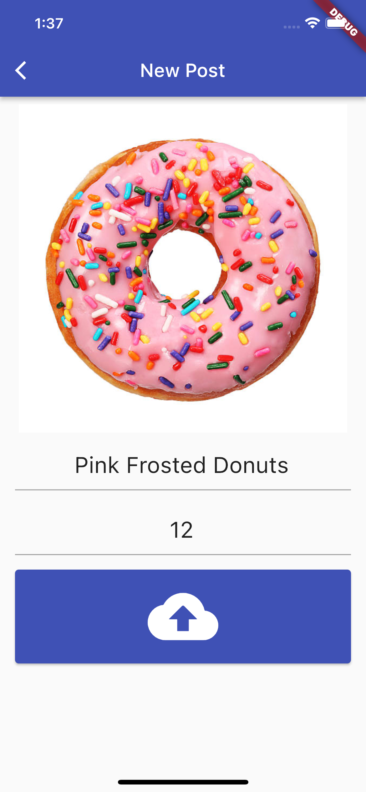
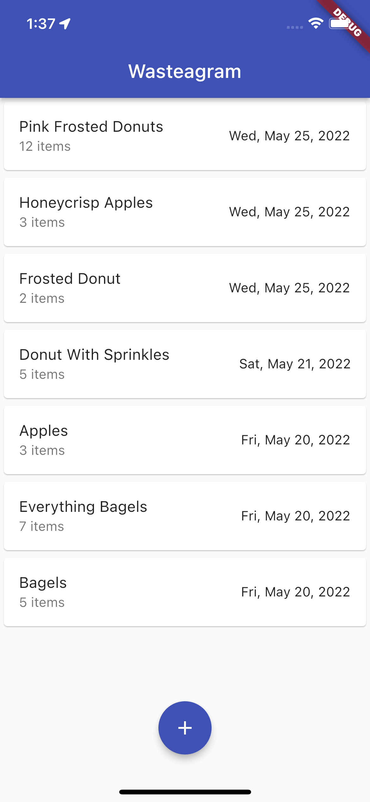

# Wasteagram

Cross-platform mobile app for Android and iOS built with Dart and the Flutter framework.

For more information about Flutter, view the
[online documentation](https://docs.flutter.dev/), which offers tutorials,
samples, guidance on mobile development, and a full API reference.

## Introduction

The fictitious client Ms. Mitchell owns a small chain of coffee shops. She envisions a mobile app inspired by Instagram called Wasteagram which will allow her to track how much unsold food is wasted every day. Every night, the person closing the shop can take out their phone and create a post consisting of a photo of the wasted food item and the number of leftover items--date and location are automatically added to each post. Ms. Mitchell can use the same app to review the posts and adjust her inventory accordingly throughout the chain.

## Overview

### Main Screen

Upon opening the app, a list of recent posts including food item, quantity left over, and the date of the post is displayed with the newest post on top.

Main Screen

### Post Detail Screen

The user can tap on any item in the list to view the details for that post. The Post Detail Screen displays the date, photo, item name, quantity wasted, and the GPS coordinates where the post was created.

Post Detail Screen

### New Post Screen

Tapping the back button on the top left of the post detail screen brings the user back to the Main Screen. On the bottom of that screen is a button to add a new post. Tapping on that button brings the user through a dialogue to choose between taking a photo with the camera or choosing a photo from the gallery. Once chosen, the user is brought to the New Post Screen.

Image Source Selection Dialog

Photo Selection
(Camera functionality is not available in the iOS Simulator, so gallery selection is shown here. Android Emulator provides a simulated camera, however. Camera functionality has been tested for Android.)

The New Post Screen displays the selected photo and prompts the user for the item name and quantity of items wasted. If either the name or the quantity is not specified, the user is prompted and cannot submit the post until both are specified.

Input Validation

Once all fields have been completed, the user taps the upload button and the post is saved.

Post ready for upload

Upon saving the post to the database, the user is brought back to the Main Screen where their post has been added to the top of the list of recent posts.

Post complete

## Implementation

Languages: 
- Dart with Flutter framework

Flutter Packages:
- **location** - Handles getting the GPS coordinates of device.
- **image_picker** - Handles picking images from the image library, and taking new pictures with the camera.
- **cloud_firestore** - Google's Cloud Firestore is a cloud-hosted NoSQL database. New posts are saved to the database. The list of recent posts on the Main Screen is read as a stream from Firestore.
- **firebase_storage** - Cloud storage for post images - images are saved to Firebase cloud storage where a URL is generated for accessing the image. The image URL is then stored in the Firestore database along with the post data.

File Organization:
- **lib directory** - holds the source code for the Flutter project.
    - **main.dart** - the entry point for the app.
    - **app.dart** - creates a Material App which provides the basic framework for the app (themes, navigation, etc.).
    - **screens/list_screen.dart** - the Main Screen - builds a scaffold (the basic structure of the screen, i.e. app bar, body, floating action button) which places the list of posts, provides the new post button, and handles the dialog for saving an image for the post (which is passed to the New Post Screen).
    - **components/post_list_view.dart** - the actual list of posts. Reads the stream of data coming in from the Firebase database and builds tiles for each document in the database. Each tile is tappable and navigates to the Post Detail Screen.
    - **screens/detail_screen.dart** - the Post Detail Screen - builds a column displaying the post details passed from the list view as a Map. In the database, the date is stored as milliseconds since epoch to facilitate sorting by date. So, the detail screen parses that into a readable format. The database holds the URL of the item image in cloud storage, so this screen must make a network request for the image. The item name, quantity, and GPS coordinates are read directly from the post object passed from the list view.
    - **screens/new_post_screen.dart** - the New Post Screen - builds a form to submit a new post. The image that is passed from the Main Screen is displayed along with inputs for item name, quantity of items wasted, and an upload button. The upload button performs input validation and calls several functions to: gather form data and GPS coordinates, upload the image to cloud storage and retrieve its URL, and write the post data to the database. The displayed column is scrollable in order to adapt to smaller screens and to prevent overflow from occuring when the software keyboard is displayed for form input.
    - **models/food_waste_post.dart** - a pure Dart class used as a data transfer object by the New Post Screen for gather post data and writing to the database
- **android and ios directories** - hold platform-specific native code (generated by Flutter)
- **test directory** - holds basic unit testing
- **pubspec.yaml** - configuration and dependencies for the Flutter project
